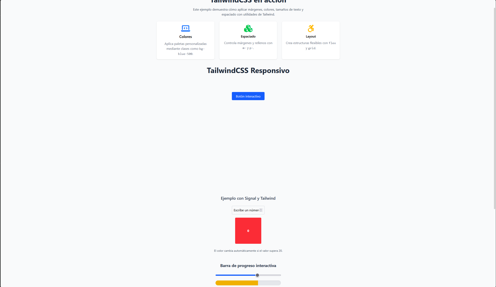

 Programación y Plataformas Web 

# Frameworks Web: Angular con tailwind

### ANGULAR

<div align="center">
  
</div>

### TAILWIND CSS

<div align="center">
  
</div>

## Práctica 3: Manejo De Estilos con Tailwind 

### Autor

**Rafael Prieto**  
📧 pprietos@est.ups.edu.ec  
💻 GitHub: [raet0](https://github.com/raet0)

---

<div align="center">
  
</div>
Lo que se observa en esta captura es una visualización completa de la página con todos los elementos estilizados e interacciones activas. La interfaz incorpora principios fundamentales de TailwindCSS, como utilidades atómicas, breakpoints responsivos, sombras, espaciados, bordes, y estados dinámicos.

Asimismo, ciertos elementos de la interfaz reaccionan de forma dinámica. Por ejemplo, en los componentes interactivos basados en Angular Signals, el color del bloque cambia según el valor ingresado por el usuario: inicia en rojo, pasa a amarillo cerca del umbral definido y cambia a verde cuando el valor supera el 40% (o el umbral correspondiente según cada implementación). Este enfoque evidencia correctamente la integración de Tailwind con la reactividad nativa de Angular.

# Informe de Estilos Implementados con TailwindCSS

## 1. Introducción

TailwindCSS es un framework CSS orientado a utilidades. En lugar de escribir reglas personalizadas, se emplean clases específicas directamente en las plantillas. Esto permite mayor control visual, escalabilidad y coherencia en proyectos Angular recientes (20+).

En esta práctica se revisan:

- Utilidades básicas (márgenes, tipografía, colores, sombras, layout).
- Breakpoints responsivos.
- Componentes estilizados (cards, botones, cajas dinámicas).
- Un ejemplo interactivo con Angular Signals.

---

## 2. Desglose de utilidades TailwindCSS empleadas

### 2.1. Clases generales vistas en la práctica

Las utilidades de TailwindCSS permiten controlar:

- **Espaciados:** `m-`, `p-`, `mt-`, `px-`, etc.  
- **Tipografía:** `text-lg`, `font-bold`, `text-center`.  
- **Fondos y colores:** `bg-gray-50`, `text-gray-500`, `bg-blue-600`.  
- **Sombras y bordes:** `shadow`, `rounded-lg`, `border`.  
- **Display y layout:** `flex`, `grid`, `justify-center`, `items-center`.  
- **Dimensiones:** `w-full`, `w-40`, `h-32`.  

Orden recomendado para mantener un código legible:

1. Layout  
2. Box model  
3. Tipografía  
4. Decoración  
5. Estados  
6. Breakpoints  

---

## 3. Componentes creados en la práctica

### 3.1. Sección principal

```html
<section class="min-h-screen bg-gray-50 flex flex-col items-center justify-center p-8">
```

# Caracteristicas clave
min-h-screen: ocupa toda la altura del viewport.

flex + flex-col: orden vertical del contenido.

justify-center + items-center: centrado total.

p-8: 32px de padding.

bg-gray-50: fondo gris claro.

# Contenedor Grip
```html
<div class="grid grid-cols-1 sm:grid-cols-2 lg:grid-cols-3 gap-6 w-full max-w-4xl">
```
## Comportamiento responsivo:

Móviles: 1 columna

Pantallas medianas (sm): 2 columnas

Pantallas grandes (lg): 3 columnas

## Clases responsables:
grid-cols-1, sm:grid-cols-2, lg:grid-cols-3.

### 3.3. Tarjetas (Cards)

```html
<div class="bg-white shadow rounded-lg p-6 flex flex-col items-center">
  <i class="fa-solid fa-border-all text-4xl text-green-500 mb-2"></i>
  <h3 class="text-lg font-semibold mb-2">Espaciado</h3>
  <p class="text-gray-500 text-center">
    Controla márgenes y rellenos con <code>m-</code> y <code>p-</code>.
  </p>
</div>
```

**Propiedades destacadas:**

- Fondo blanco (**bg-white**) y sombra (**shadow**).  
- Bordes redondeados (**rounded-lg**).  
- Ícono grande y centrado (**text-4xl text-green-500**).  
- Texto organizado mediante **flex flex-col items-center**.

---

### 4. Ejemplo interactivo: Angular Signals + TailwindCSS

Se emplea una señal para controlar el valor ingresado:

```ts
valor = signal<number>(0);
```

Cuadro que cambia de color según el valor:

```html
<div
  class="w-32 h-32 flex items-center justify-center text-white font-bold rounded transition-all duration-500"
  [class.bg-green-500]="valor() > 20"
  [class.bg-red-500]="valor() <= 20"
>
  {{ valor() }}
</div>
```

**Comportamiento:**

- <= 20: rojo  
- > 20: verde  
- Transición suave (**transition-all duration-500**)  
- Sin **ngModel** ni **ngIf**; todo con **Signals** y clases dinámicas.

**Este ejemplo demuestra:**

- Reactividad moderna con Angular.  
- Estilos condicionales en tiempo real.  
- Mejoras de accesibilidad (focus, transiciones).

---

### 5. Resultado Final de la Práctica

La página final incluye:

- Layout responsivo basado en **grid**.  
- Tarjetas estilizadas con información didáctica.  
- Títulos y textos adaptados a **breakpoints**.  
- Botón interactivo con estados **hover** y **focus**.  
- Componente reactivo con **Angular Signals** que cambia de color según un umbral.

El resultado muestra un manejo adecuado tanto del framework Angular como de TailwindCSS, aplicando utilidades, reactividad y diseño responsivo bajo buenas prácticas.
